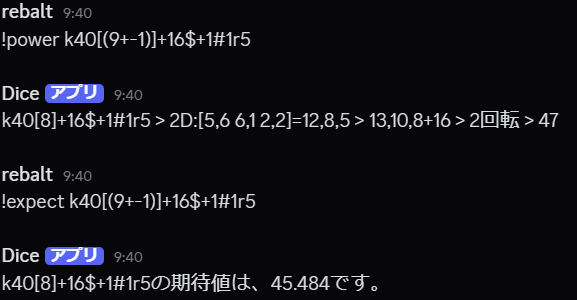

私は趣味と実用を兼ねて、C#とDiscordを用いたTRPG支援用のDiscord Botを開発しました。
このBotは、TRPGプレイ中に発生する複雑なダイスロールや期待値計算を自動で行うもので、プレイヤーの負担軽減とゲームの円滑化を目的としています。

このBotは、TRPG支援ツール「ココフォリア」のコマンド（例: k70[9]+2）を参考にして、実装しました。

コマンドは以下の二つがメインです。
・!power
    ダイスを振り、ダメージの決定をします。
・!expect
    ダイスを振らず、期待値の計算をします。

